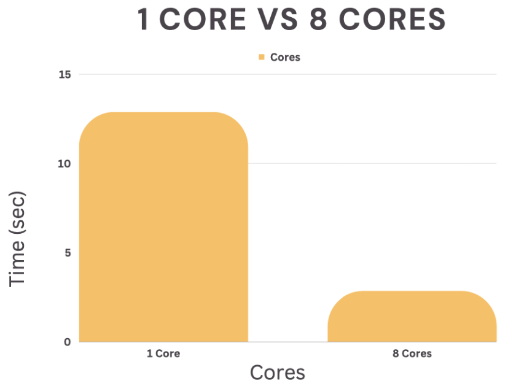

# Reducing-Prediction-Time-Larger-Dataset-Using-Embarassingly-Parallel-Computing

## Overview
With the use of large sizes, dataset time has always been a crunch. This study investigates the use of multiprocessing and how we can reduce the time for large datasets. So for that, we have taken a dataset where we will be predicting the genres of the books. We will be using built-in parallel processing for training the model and comparing it with others. With new data, we will be using embarrassingly parallel computing to predict, and then we will be comparing with serial processes. We will be implementing this process with the help of a supercomputer. Results tell us that training the model in parallel reduced the time. Similarly, prediction time has been reduced with the use of embarrassingly parallel computing. Varied the dataset size for multiple cores and recorded the time.
Overall, parallel computing can be a useful tool for speeding up the processing of large datasets. By distributing the workload across multiple processes, you can potentially reduce the amount of time it takes to process the data and take advantage of the multiple cores on your computer.

## Problem Statement
The project focuses on the embarrassing parallel computing used for large datasets. One potential problem that you might face when working with large datasets is that the processing time can be slow. The burden might be distributed among several processes or machines using multi-processing or parallel processing to solve this issue, potentially reducing the processing time. The methodology will use parallel computing, evaluate performance, and compare results with serial computing.
Firstly, we will train a machine learning algorithm. Then we send the new data to the trained model using parallel computing, which involves utilising the various cores on the system by using multi- processing or parallel processing, which could shorten the time it takes to predict the data.
Compare the performance of parallel computing with serial computing. We will do a few experiments and record the time required. After that, we'll examine these tests' outcomes and discuss the importance of what we learn.

## Architecture

## Methodology

The following steps comprise the methodology for employing embarrassingly parallel computing:
### Processes in Step1:
1. Data has been imported, which is in CSV format. The data contained 100k rows and ten columns.
2. Preprocessing has been done by filtering the unwanted features. At last, we are settled on four features. The features are - ‘author_id’, ‘book_rating’, ‘publish_year’, and ‘text_lang’, and the target column is ‘book_genre’. A standard scaler is used to make the mean 0.
3. A random forest classifier is selected. Model training is done in parallel. Training time has been recorded for both with one core and eight cores. This will be shown in the later part of this report.
### Processes in Step2:
1. We are supplying the trained model with the same set of data. Data will be transmitted in parallel, and very quickly, predictions for the entire dataset will be generated.
2. Compare the overall performance of the parallelised with that of a non-parallelised code. This could involve running equal experiments with a non-parallelised code and evaluating the outcomes to the ones acquired with the parallelised code.
This technique offers a general framework for enforcing embarrassingly parallel computing on a large dataset and may be tailored to many datasets.

## Result

### Training time:

Using 1 core : 12.488 sec.
Using 8 cores : 2.84 sec

Below screenshots shows the training using 1 core and 8 cores.

In the case of training a model, using parallel processing can be 4.39 times faster than using serial processing. This is because parallel processing allows the training to be divided into smaller parts that can be executed simultaneously on multiple cores or processors, leading to faster completion of the task.

### Prediction time:

The time has significantly reduced when new data has been fed to the model. I have done this using carnie and used different cores for different data sizes and recorded time for both serial and parallel. Also, I have calculated SpeedUP and Efficiency.
Below is the table showing numerical results.

### Graphs
#### Serial vs Parallel
How serial and parallel is being used for different cores w.r.t time and size. As the number of cores or processors used for a task increases, the time required to complete the task using parallel processing can be reduced compared to serial processing.

#### SpeedUP
Using multiple cores or processors to perform a task speeds up the completion of the task compared to using a single core or processor. In the case of using 16 cores compared to 8 cores, the speedup is roughly double, and using 24 cores compared to 8 cores can provide a triple speedup. This indicates that increasing the number of cores or processors used for a task can significantly improve its performance and speed up its completion.

#### Efficiency
The efficiency of using multiple cores or processors for a task is similar, regardless of the size. However, as the size of the task increases, the efficiency of using higher numbers of cores or processors may also increase. This is because larger tasks can be divided into smaller parts, which can be executed simultaneously on multiple cores or processors, potentially leading to faster task completion.

## Conclusion
In summary, working with large datasets can be very time-consuming, but using embarrassingly parallel computing can help improve the prediction speed for these datasets. By breaking the workload into smaller parts that can be executed simultaneously on multiple cores or processors, the time required for the prediction can be significantly reduced. In general, using embarrassingly parallel computing can be a valuable tool for speeding up a prediction on large datasets.

